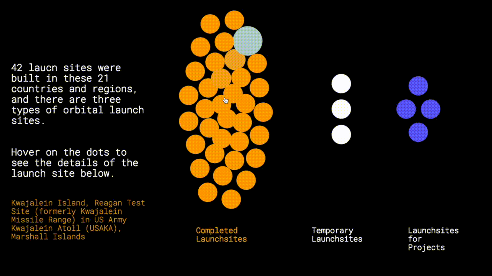

## Space Odyssey - A Glimpse into the Space Age

 - [Live Version](https://alexwang624.github.io/cdv-student/projects/data-story/finished/)

### About This Project:
 Wanna know what is happening in space? Take a look at Space Odyssey - A Glimpse into the Space Age! This is a web-based data visualization project on the technological developments during the Space Age. With data from 5 datasets, this project presents a interactive timeline of significant events in space during the Space Age and includes several visualizations on the information of orbital spaceflights.

### Datasets Used in This Project:
  - [UCS Satellite Database](https://www.ucsusa.org/resources/satellite-database)
  - [Chronology of Space Launches](https://space.skyrocket.de/directories/chronology.htm)
  - [Launch Sites](https://space.skyrocket.de/directories/launchsites.htm)
  - [Chronology of Significant Events in Space](https://en.wikipedia.org/wiki/Space_Age#:~:text=The%20Space%20Age%20is%20a,continuing%20to%20the%20present%20day.)
  - GeoJSON Data for Countries in the World

### Methodology:
[UCS Satellite Database](https://www.ucsusa.org/resources/satellite-database) can be downloaded in Excel format and converted to a cvs file. I used a free web scraper called [ParseHub](https://www.parsehub.com/) for scraping the data on [Chronology of Space Launches](https://space.skyrocket.de/directories/chronology.htm) and [Launch Sites](https://space.skyrocket.de/directories/launchsites.htm). For the data in [Chronology of Significant Events in Space](https://en.wikipedia.org/wiki/Space_Age#:~:text=The%20Space%20Age%20is%20a,continuing%20to%20the%20present%20day.), I directly copied and pasted them in a Google Sheets and then exported them in a json file.

## The Process

### Why did you choose to visualize the data in this way?
I wanted to actually tell the story of the Space Age in detail and enable the audience to know more about what happened during the Space Age, instead of just creating some visualizations with super cool effects but not so readable. Therefore, I think the visualizations in my project look very "traditional" with some hovering and scrolling effects. The visualization for each section looks different so that the audience would not get bored starring at visualizations that look similar to each other. I kept the colors in my project simple, mainly purple, white, and orange, for a consistency in aesthetics, and chose a simple looking font for the readability of my project.

### What can be seen in the visualization? Does it reveal something you didn't expect?
This project consists of
- a scrollable interactive timeline of significant technological events in space;
- a visualization of the numbers of orbital and suborbital spaceflights (as a transition to tell the audience that the following project will focus on orbital spaceflights only);
- a map of countries and regions that have launch sites for orbital spaceflights;
- a force graph on the detailed information on these launch sites;
- a bar chart of the number of orbital launches per year from 1957 to 2020;
- and another force graph on the currently operational satellites around the Earth.

### Did you make crucial compromises? Which ones?
One of the compromises that I made is on the map that marks the countries and regions that have launch sites for orbital spaceflights. Initially I wanted to append a circle on the location of each launch site, but not every location could be found on [teczno.com/squares](http://teczno.com/squares/#12/37.8043/-122.2712). Therefore, I had to give this idea up.

The final outcome of my project actually looks very different from my paper prototype. I changed my plan for the visualizations because I wanted them to be more readable and there are some restrictions of the datasets that I used which made me unable to create the visualizations in my prototype. For instance, in my prototype I planned to make the currently orbiting satellites to actually orbit around a 3D globe. However, the data in [UCS Satellite Database](https://www.ucsusa.org/resources/satellite-database) are not enough for this visualization. Moreover, part of the reason why I gave up my plan in the prototype is due to my lack of skills and knowledge in coding. :(

### If you had more time, what would you change, improve, add to the project?
I would make the force graph of currently orbiting satellites interactive, and add a navigation in this project as Adrien suggested after my presentation. In addition, I can also make some visualizations of data on suborbital spaceflights as well for a more completed story-telling of the Space Age. In addition, more contextual information could be added in this project for the audience who have no knowledge of technologic advances related to the space.

There are some small bugs that I could fix to make this project better. Winny messaged me after my presentation and told me that when she dragged the circle in this part above, her mouse will still hover other circles so the text on the left will keep changing. I will fix this bug if I had more time.
